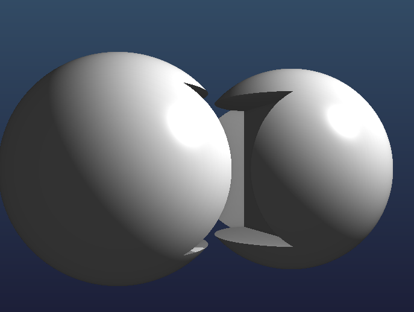

# Implicit Boolean CSG

A real-time renderer for Constructive Solid Geometry (CSG) operations on implicit surfaces using ray marching techniques.

## Overview

This project implements a visualization system for Boolean operations (union, intersection, difference) on implicit surfaces. The implementation uses OpenGL and GLSL for GPU-accelerated rendering.

## Features

- Various primitive shapes: spheres, boxes, cylinders, and planes
- Boolean operations: union, intersection, and difference
- Smooth blending between surfaces using smooth boolean operations
- Real-time interactive visualization with automatic camera rotation
- Scene switching using keyboard shortcuts

## Controls

- **1**: Display a single sphere
- **2**: Display CSG union operation
- **3**: Display CSG intersection operation
- **4**: Display CSG difference operation
- **5**: Display complex CSG scene
- **C**: Display custom CSG scene
- **ESC**: Exit the application

## Building the Project

### Prerequisites

- C++17 compatible compiler
- CMake 3.14 or higher
- vcpkg package manager
- GLEW and GLFW3 libraries

### Build Steps

1. Clone the repository
2. Configure with CMake:
   ```
   cmake -B build -S . -DCMAKE_TOOLCHAIN_FILE=[path to vcpkg]/scripts/buildsystems/vcpkg.cmake
   ```
3. Build the project:
   ```
   cmake --build build --config Release
   ```
4. Run the executable:
   ```
   build/bin/Release/ImplicitBooleanCSG
   ```

## Implementation Details

The system uses ray marching to render implicit surfaces defined by signed distance functions (SDFs). Boolean operations are implemented by combining these distance functions.

